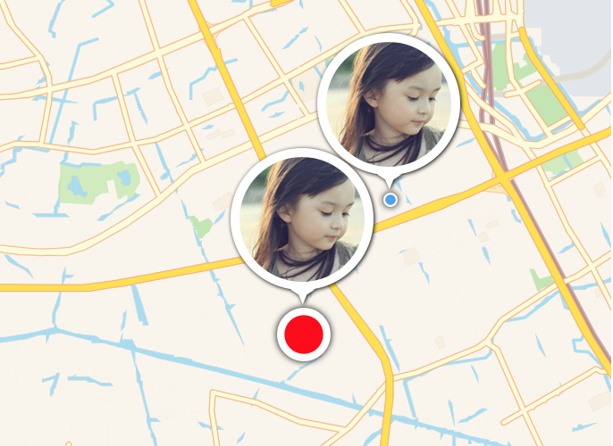
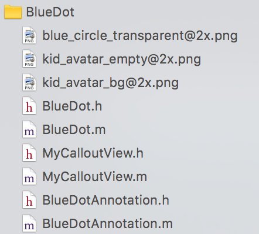

# 模拟 MapKit 的小蓝点

MapKit 中有一种特殊的标注，用于在地图上显示一个“跳动的”小蓝点，也就是  MKUserLocation 类。那么有没有可能通过自定义大头钉的方式模拟 MapKit 的这种小蓝点？答案是肯定的。BlueDot 类（继承自 MKAnnotationView）和 BlueDotAnnotation(实现了 MKAnnotation 协议)能够帮助你。



## 用法

使用时，直接将以下源文件拖到你的 Xcode 项目中。




在你的 ViewControllere 类中，引入相应头文件：

```swift
#import "BlueDot.h"
#import "BlueDotAnnotation.h"
```

##添加小蓝点

```swift
BlueDotAnnotation *anno=[[BlueDotAnnotation alloc]init];
anno.coordinate=center;
anno.image = [UIImage imageNamed:@"kid_avatar_2"];
anno.selected = NO;
[self.mapView addAnnotation:anno];
```
BlueDotAnnotation 是 BlueDot 在 MapView 上的抽象表示，创建好一个 BlueDotAnnotation 实例之后，你必须设置它的坐标（coordinate属性）、气泡图片（image属性，可选）、或状态（selected 属性，可选），然后调用 addAnnotation: 方法添加到地图中。

##实现委托

首先声明你的 ViewController 实现 MKMapViewDelegate 协议，将 MapView 的 delegate 设置为你的 ViewController。

然后在你的 ViewController 中实现协议方法：

```swift
- (nullable MKAnnotationView *)mapView:(MKMapView *)mapView viewForAnnotation:(id <MKAnnotation>)annotation{
    if([annotation isKindOfClass:[BlueDotAnnotation class]]){
        NSString* identifier = @"blue_dot";
        
        // 使用自定义的 BlueDot 代替 MAAnnotationView
        BlueDot* blueDot = (BlueDot*)[mapView dequeueReusableAnnotationViewWithIdentifier:identifier];
        if(blueDot == nil){
            blueDot = [[BlueDot alloc]initWithAnnotation: annotation reuseIdentifier: identifier];
            blueDot.delegate = self;
        }
        return blueDot;
    }
    return nil ;
}
```

这个协议方法负责为小蓝点提供自定义的视图（BlueDot）。在这个例子中，我们根据 annotation 的实际类型，创建我们自定义的小蓝点视图（BlueDot），然后 annotation 转换为我们自定义的 BlueDotAnnotation，并用它来渲染 BlueDot 对象，然后返回这个对象。

## BlueDotDelegate 委托

每个小蓝点都有一个委托属性，这是一个实现了 BlueDotDelegate 协议的对象，这个协议中只有一个方法 blueDotClicked:，当用户点击了小蓝点的气泡图片（即 calloutView）时调用这个方法。

在你的 ViewController 中实现这个方法：

```swift
-(void)blueDotClicked:(BlueDotAnnotation*)annotation{
    annotation.selected = !annotation.selected;
    [_mapView removeAnnotation:annotation];
    [_mapView addAnnotation:annotation];

    
}
```
在这个例子中，我们切换 annotation 的 selected 属性（BOOL）。并刷新地图上的大头钉，这会导致小蓝点的颜色在红色（选中）- 蓝色（未选中）之间切换。

## 定制

小蓝点的样式通过 BlueDotAnnotation 定制。BlueDotAnnotation 提供了如下属性 ：

* CGFloat period;

	小蓝点的收缩周期，单位秒，默认 0.5。

* CGFloat minPercent;

	小蓝点收缩到最小时与 frame 宽度的百分比，0-1，默认 0.55。

* CGFloat maxPercent;

	小蓝点扩张到最大时与 frame 宽度的百分比，0-1，默认 0.75。

* CGFloat width;

	小蓝点大小（宽和高），默认 28，最大可以设置为 48（即 blue_circle_transparent 图片的大小）。
	
* CGFloat shadowRadius;

	小蓝点阴影宽度，像素，默认 4。

* UIColor* defaultFillColor ;

	小蓝点未选中状态的填充颜色，默认蓝色。

* UIColor* selectFillColor;

	小蓝点选中状态的填充颜色，默认红色。

## Demo

用 Xcode 8 打开 BluDotDemo.xcodeproj，运行示例程序以查看效果。

有任何问题和建议，请与[作者](kmyhy@126.com)联系。


